# DevOpsFinalChallenge

Para la resolución de este challenge, se comenzó revisando y levantando los contenedores en el siguiente orden, verificando su correcto funcionamiento.

    1. hello-world-nodejs
    2. hello-world-golang

Una vez que los dos contenedores anteriores funcionaron correctamente, se pasó a levantar y realizar la conexión con el contenedor `hello-world-nginx`. Para llevar a esto a cabo se desarrolló el archivo `docker-compose.yml`. 

Cuando quedaron los tres servicios levantados y funcionando correctamente, se pasó a diseñar e implementar el archivo `docker-image.yml`, el cual contiene los pasos a seguir para el CICD con github Actions, que permite desplegar a DockerHub las aplicaciones Node y Golang.

Por último se realizó un archivo `script-run.sh`, el cual permite correr todos los contenedores en un sólo comando.

A continuación se detallan cada uno de los cambios en las distintas aplicaciones y los distintos archivos, en orden de como se fué realizando el trabajo.

## Cambios y correcciones hello-world-nodejs.

### Archivo Dockerfile.

Los cambios que se realizaron son los siguientes
    
    1. Se cambió la imagen del contenedor de `node:16` a `FROM node:14-alpine `, la segunda imagen es más liviana.
    2. Se cambió para que solo copie el contenido de la carpeta `server`
    3. Se expuso el puerto 3000, ya que no estaba, para poder comunicarse desde el host al contenedor.
    4. Se levantó el contenedor y se comprobó que funcione correcatamente.
    
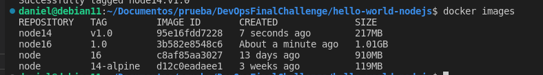
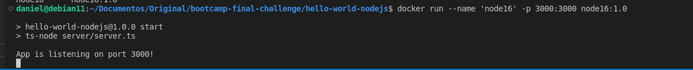
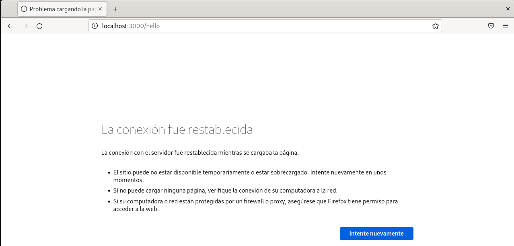
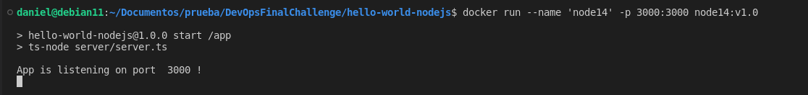
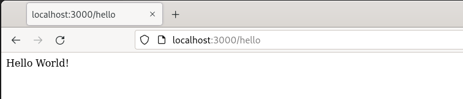

El archivo Dockerfile quedó de la siguiente manera.

```bash
FROM node:14-alpine 
WORKDIR /app 

COPY package*.json ./ 
RUN npm install 

COPY ./server ./server 
EXPOSE 3000

CMD ["npm", "run", "start"]
```

## Archivo server.ts.

En este archivo se cambió la línea `app.listen(3000, "127.0.0.1", function () {`.
En la misma se eliminó el segundo argumento `"127.0.0.1"` ya que la misma generaba inconvenientes. También se reemplazó el número de puerto por una variable, para poder desplegarlo en Heroku.

Con estos cambios el archivo server.ts quedó de la siguiente manera.

```bash
import express from "express";

const PORT = process.env.PORT || 3000;
// Create a new express app instance
const app: express.Application = express();
app.get("/hello", function (req, res) {
  res.send("Hello World!");
});
app.listen(PORT, function () {
  console.log("App is listening on port ", PORT, "!");
});
```
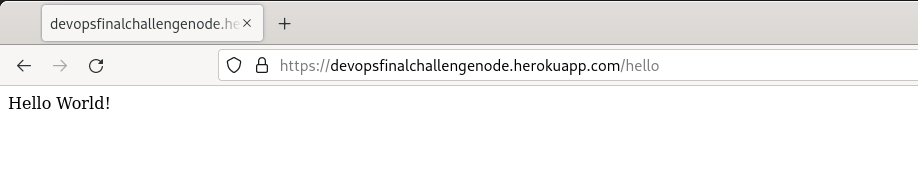

### Conclusión.

Con los cambios realizados en estos dos archivos, esta aplicación quedó andando correctamente dentro de un contenedor y corriendo en Heroku.
Al cambiar la versión de la imagen de node, disminuyó el tamaño.

## Cambios y correcciones hello-world-golang.

### Archivo Dockerfile.

El archivo Dockerfile estaba vacío. El mismo se programó y quedó de la sigueinte manera

```bash
FROM golang:1.18

WORKDIR /usr/src/app

COPY . .

EXPOSE 3002

CMD ["go", "run", "app.go"]
```

Luego se realizó una prueba para correr un contenedor con la imagen generada por el Dockerfile para comprobar su correcto funcionamiento.

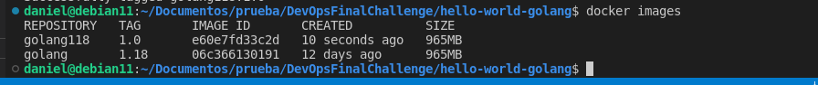
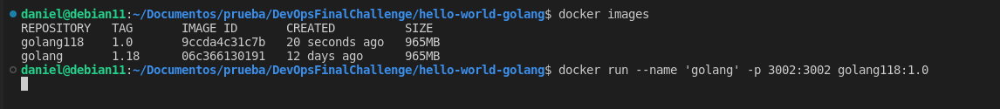
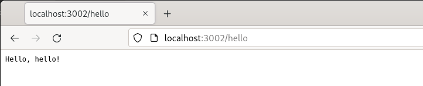
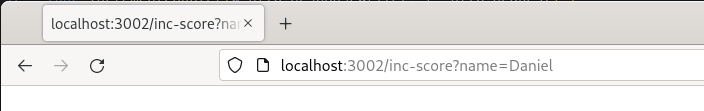
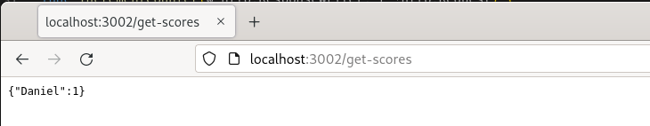

## Archivo app.go.

En este archivo se cambiaron algunas líneas para poder desplegarlo en Heroku.

```bash
package main

import (
	"encoding/json"
	"fmt"
	"net/http"
	"os"
)

var scores = make(map[string]int)

func main() {

	port := os.Getenv("PORT")

    if port == "" {
        port = "3002"
    }

	http.HandleFunc("/hello", HelloServer)
	http.HandleFunc("/inc-score", IncrementCounter)
	http.HandleFunc("/get-scores", GetScores)
	http.ListenAndServe(":"+port, nil)

}

func HelloServer(w http.ResponseWriter, r *http.Request) {
	fmt.Fprintf(w, "Hello, %s!", r.URL.Path[1:])
}

// IncrementCounter increments some "score" for a user
func IncrementCounter(w http.ResponseWriter, r *http.Request) {
	name, ok := r.URL.Query()["name"]
	if !ok {
		w.WriteHeader(http.StatusOK)
	}
	scores[name[0]] += 1
	w.WriteHeader(http.StatusOK)
}

// GetScores gets all the scores for all users
func GetScores(w http.ResponseWriter, r *http.Request) {
	b, _ := json.Marshal(scores)
	w.WriteHeader(http.StatusOK)
	w.Write(b)
}

```
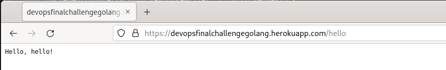
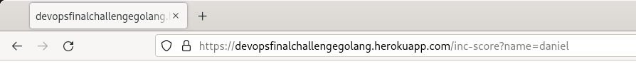
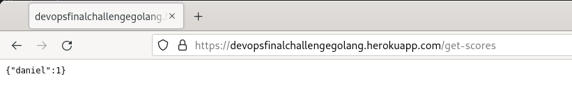

### Conclusión.

Con los cambios realizados en la app y como se programó el Dockerfile, tanto en local como en Heroku, quedó corriendo y funcionando.